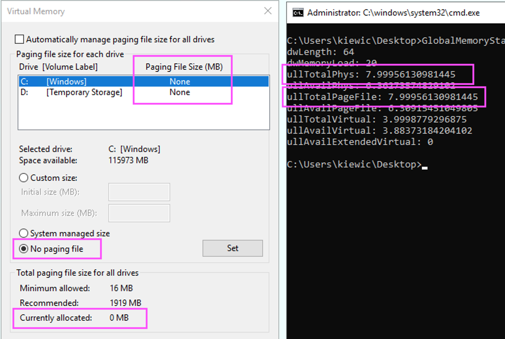

# GlobalMemoryStatusEx App

This is a C# console application that PINVOKEs Win32 `GlobalMemoryStatusEx()` API.

The purpose of this application is to demostrate that `MEMORYSTATUSEX.ullTotalPageFile` is composed by the physical memory (`MEMORYSTATUSEX.ullTotalPhys`) plus Windows paging file (*C:\pagefile.sys*).

Example: in the following screenshot, paging file is disabled and its size is 0 MB. Therefore, the value of `MEMORYSTATUSEX.ullTotalPageFile` is equal to `MEMORYSTATUSEX.ullTotalPhys`.

